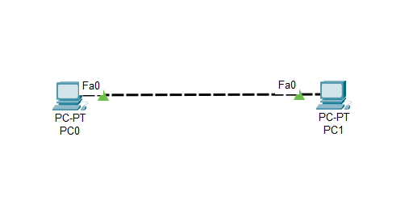
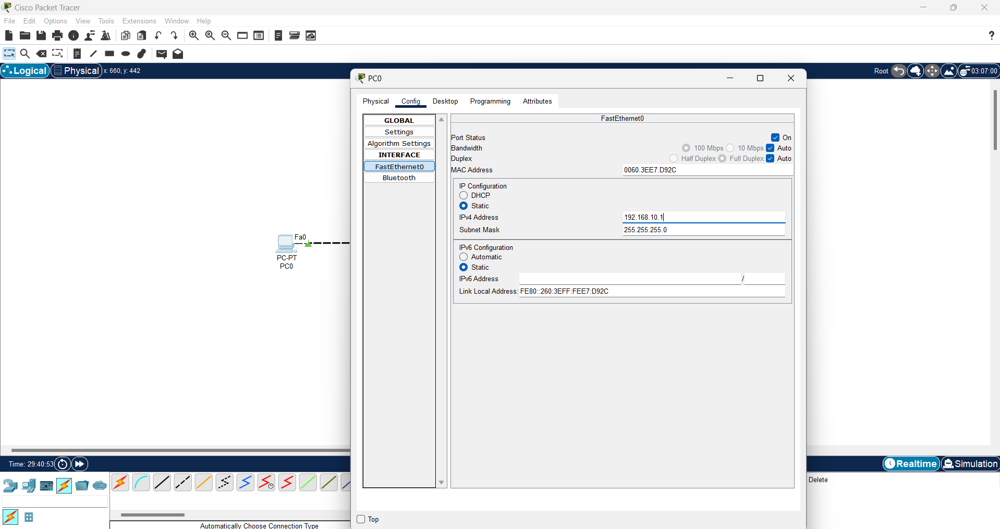
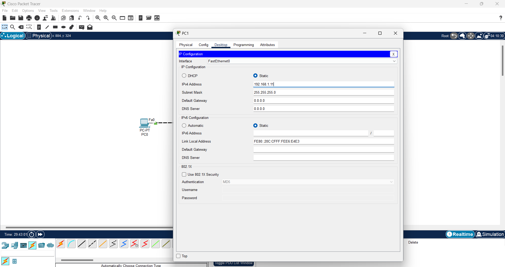
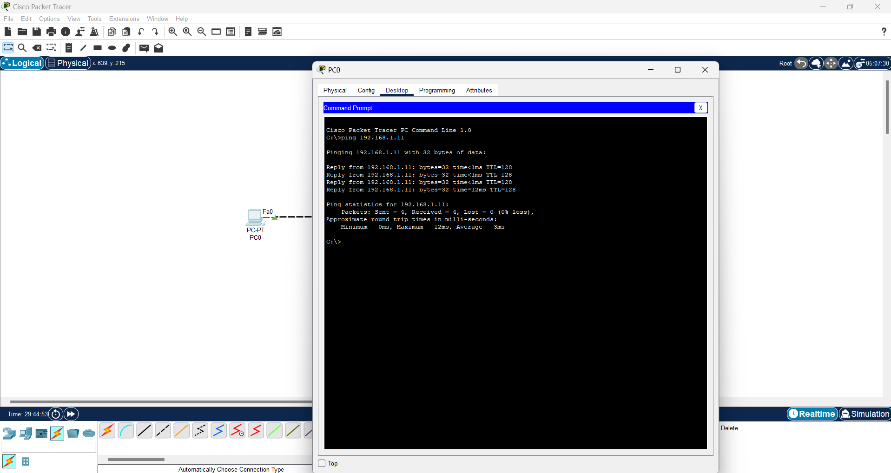
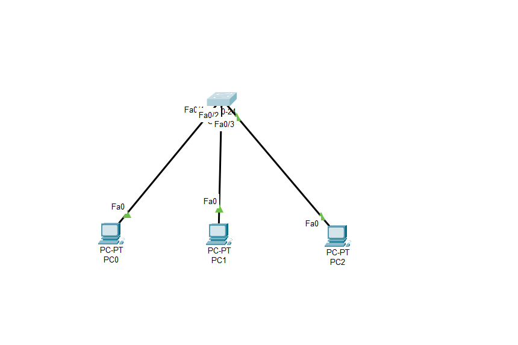
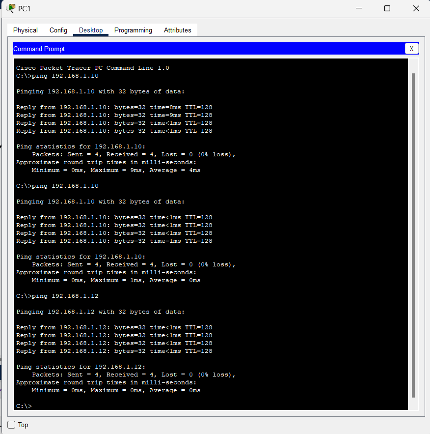

# CISCO PACKET TRACER

## 1. Connecting Two Computers

### 1.1. Directly Connecting Two Computers

#### 1.1.1. Steps

1. Open Cisco Packet Tracer.
2. Click on `End Devices` in the bottom left corner.
3. Drag and drop `PC` to the workspace.
4. Click on `Connections` in the bottom left corner.
5. Click on `Copper Straight-Through`,`Copper Cross-Over ` or `Automatic connection` cable.
6. Click on the first PC and then click on the second PC.
  

7. Click on one of the PCs and click on `Desktop`->`ip configuration` tab to setup the IP address or use `config`->`FastEthernet0`->`static`.
  

  
8. Click on the other PC and click on `Desktop`->`ip configuration` tab to setup the IP address or use `config`->`FastEthernet0`->`static`.
9. `ping` the other PC to check the connection.

#### 1.1.2. Project File
[Connecting Two Computers](connecting_two_computers.pkt)

## 2. Star Topology

use `switch` to connect multiple computers.like a star shape.
  

#### 2.1. Steps

1. Open Cisco Packet Tracer.
2. Click on `End Devices` in the bottom left corner.
3. Drag and drop `PC` to the workspace.
4. Click on `Connections` in the bottom left corner.
5. Click on `Copper Straight-Through`,`Copper Cross-Over ` or `Automatic connection` cable.
6. Click on the first PC and then click on the second PC.
7. Click on the switch and connect all the PCs to the switch.
8. Click on one of the PCs and click on `Desktop`->`ip configuration` tab to setup the IP address or use `config`->`FastEthernet0`->`static`.
9. Click on the other PC and click on `Desktop`->`ip configuration` tab to setup the IP address or use `config`->`FastEthernet0`->`static`.
10. `ping` the other PC to check the connection.

same as above, but use `switch` to connect multiple computers.

#### 2.1. Project File

[Star Topology](star_topology.pkt)